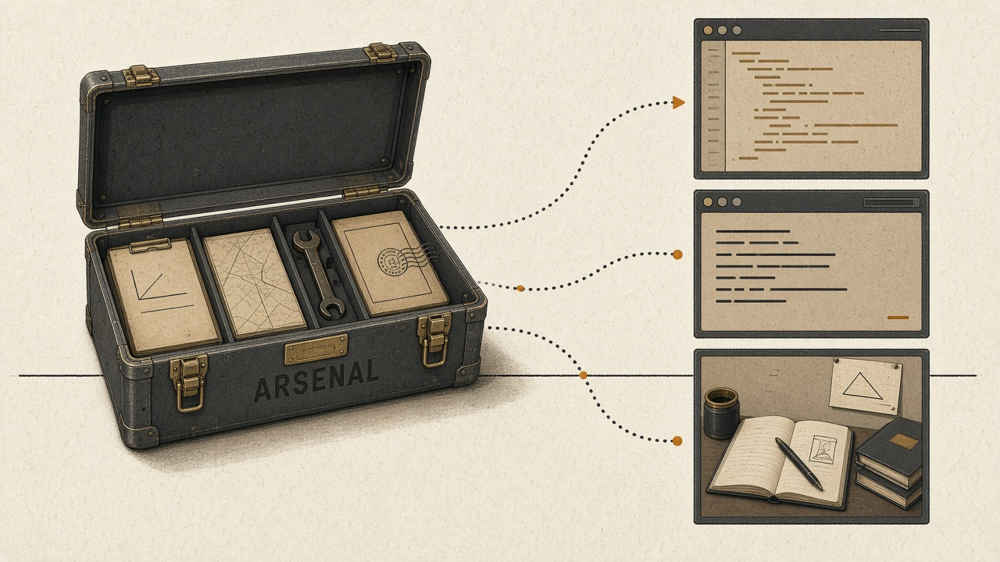

# Arsenal



Portable skills to carry into any project or harness. Each skill lives in `skills/<name>/SKILL.md`,
the open Agent Skills format, so any agent that reads `SKILL.md` can use it.

## Install

### Claude Code

```
/plugin marketplace add matiinchauspe/arsenal
/plugin install arsenal@arsenal
```

Skills are namespaced by the plugin: `teach` is invoked as `/arsenal:teach`.

To try a local checkout without installing it:

```
claude --plugin-dir path/to/arsenal
```

### Other agents

Point the agent's skill discovery at `skills/`, or copy or symlink a single `skills/<name>/` folder
into the agent's skills directory.

## Skills

| Skill   | What it does | Invocation |
| ------- | ------------ | ---------- |
| `teach` | Teaches you a topic over several sessions: a mission, short interactive HTML lessons, reference sheets, a glossary and learning records | user (`/arsenal:teach <topic>`) |

### `teach`: where your learning lives

Each topic gets its own **learning workspace**, kept apart from whatever project you opened the agent in:

- `$ARSENAL_LEARN_HOME/<topic>/` when the variable is set, else `~/learn/<topic>/`.
- If the current directory already holds a `MISSION.md`, that directory is the learning workspace.

Run `/arsenal:teach` with no topic to pick up one you already started.

## Layout

```
arsenal/
├─ .claude-plugin/
│  ├─ marketplace.json   ← this repo is a marketplace…
│  └─ plugin.json        ← …that ships one plugin, `arsenal`
└─ skills/<name>/SKILL.md
```

Add a skill by adding a folder under `skills/`; the plugin picks it up with no manifest change.
Validate with `claude plugin validate .`.

## License

MIT. `skills/teach` is adapted from [mattpocock/skills](https://github.com/mattpocock/skills) (MIT);
both notices are in [LICENSE](LICENSE).
